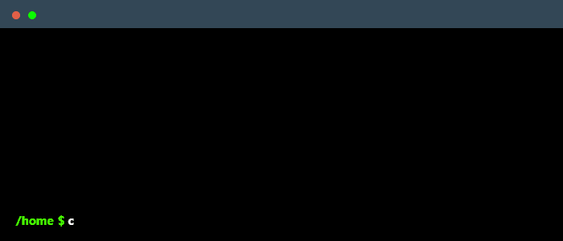

## Hi, welcome to my Github!

* :boy: 24 years old
* :rocket: Pursuing a bachelor's degree in Software Engineering
* :green_book: Machine Learning, Game Development, Algorithms
* :office: Currently working at [F3Capital](https://f3capital.com.br)

## :computer: Stack I'm currently working with 

 
  
  
  
  
   
 
 
  
  
 
## Other techs I :heart:

 

## My latest posts

<!--START-BLOG-POSTS-->
  
<!--END-BLOG-POSTS-->

## :notebook_with_decorative_cover: My Stats

## :telephone_receiver: Contact Me 

